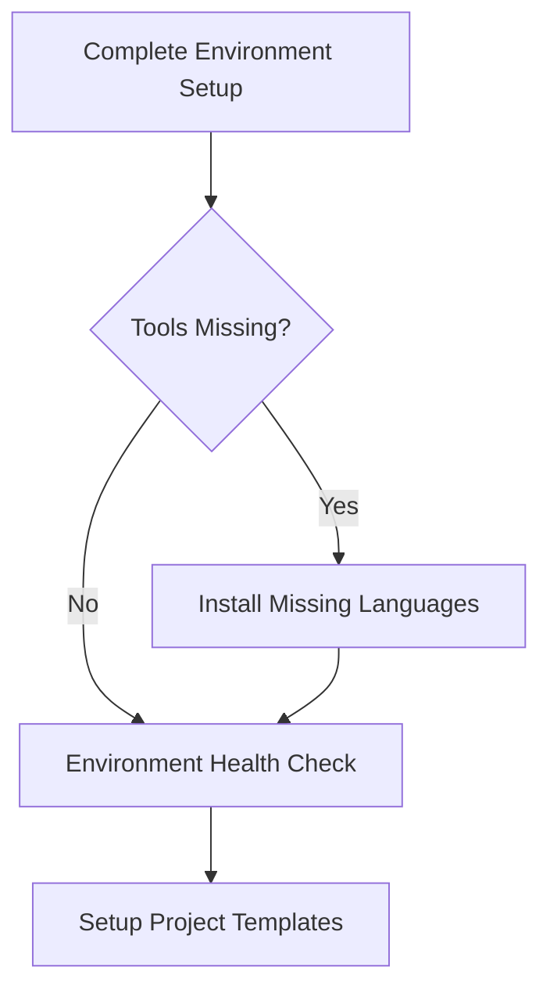
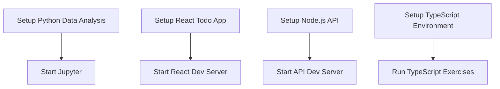

# 🛠️ VS Code Tasks Guide - GitHub Copilot Certification Workspace

## 📋 Quick Start Guide

This workspace includes **35+ automated VS Code tasks** to streamline your GitHub Copilot certification preparation. All tasks are accessible via:

**`Ctrl/Cmd + Shift + P` → "Tasks: Run Task"**

## 🚀 **FIRST TIME SETUP (Start Here!)**

### 1. Check Your Environment
```
🚀 Complete Environment Setup
```
- **What it does**: Detects your OS and checks all programming language installations
- **Prerequisites**: None
- **Duration**: 30 seconds

### 2. Get Installation Instructions  
```
📋 Installation Guide
```
- **What it does**: Shows platform-specific installation commands for missing tools
- **Prerequisites**: None
- **Duration**: Instant

### 3. Install Missing Tools (macOS Users)
```
🛠️ Install Missing Languages
```
- **What it does**: Automatically installs Go and Rust via Homebrew
- **Prerequisites**: macOS with Homebrew
- **Duration**: 3-5 minutes

### 4. Verify Everything Works
```
🩺 Environment Health Check
```
- **What it does**: Comprehensive verification of all development environments
- **Prerequisites**: None
- **Duration**: 30 seconds

## 📚 **SYSTEM REQUIREMENTS**

### Essential Tools (Required)
- **Python 3.8+**: Core exercises and data analysis
- **Node.js 16+**: React/TypeScript projects
- **Java 11+**: Some advanced exercises
- **VS Code**: For running tasks

### Optional Tools (Auto-installable)
- **Go 1.18+**: Microservices exercises
- **Rust 1.60+**: High-performance exercises

### Platform-Specific Package Managers
- **macOS**: Homebrew (recommended)
- **Windows**: Winget or manual installation
- **Linux**: apt, yum, or manual installation

## 🎯 **TASK CATEGORIES & USAGE**

### 🚀 Environment Setup (8 tasks)
| Task | Prerequisites | Duration | Purpose |
|------|---------------|----------|---------|
| Complete Environment Setup | None | 30s | OS detection & tool checking |
| Installation Guide | None | Instant | Platform-specific install instructions |
| Setup Python Environment | Python 3.8+ | 1 min | Cross-platform pip setup |
| Install Go Language | macOS + Homebrew | 2-3 min | Automated Go installation |
| Install Rust Language | macOS + Homebrew | 2-3 min | Automated Rust installation |
| Install Missing Languages | macOS + Homebrew | 3-5 min | Auto-install Go & Rust |
| Environment Health Check | None | 30s | Verify all installations |
| Quick Project Setup | None | Instant | Interactive setup guide |

### 🏗️ Project Templates (6 tasks)
| Task | Prerequisites | Duration | Purpose |
|------|---------------|----------|---------|
| Setup Python Data Analysis | Python 3.8+ | 2-3 min | Create venv & install packages |
| Start Jupyter for Data Analysis | Python setup complete | 30s | Launch notebook server |
| Setup React Todo App | Node.js 16+ | 1-2 min | Install React dependencies |
| Start React Todo App | React setup complete | 30s | Launch dev server |
| Setup Node.js API | Node.js 16+ | 1-2 min | Install API dependencies |
| Start Node.js API Dev Server | Node.js setup complete | 30s | Launch API server |

### 🧪 Practice Exercises (12 tasks)
| Task | Prerequisites | Duration | Purpose |
|------|---------------|----------|---------|
| Setup TypeScript Environment | Node.js 16+ | 1 min | Install TypeScript tools |
| Run TypeScript Advanced Exercises | TypeScript setup | Varies | Execute TS exercises |
| Run Python Practice Exercises | Python 3.8+ | Instant | List available exercises |
| 🐹 Run Go Exercise | Go installed | Varies | Execute Go code with detection |
| 🦀 Run Rust Exercise | Rust installed | Varies | Execute Rust code with detection |
| 🔧 Setup Go Project | Go installed | 1 min | Create new Go module |
| 🦀 Setup Rust Project | Rust installed | 1 min | Create new Cargo project |
| Practice Exercise Guide | None | Instant | Complete exercise overview |

### 📝 Testing & Assessment (9 tasks)
| Task | Prerequisites | Duration | Purpose |
|------|---------------|----------|---------|
| Run Practice Test 1 | None | 30 min | Basic knowledge test |
| Run Practice Test 2 | None | 45 min | Advanced features test |
| Run Practice Test 3 | None | 45 min | Comprehensive review |
| Run Practice Test 4 | None | 45 min | Emerging features test |
| Open Progress Tracker | None | Instant | Track study progress |
| Check Study Progress | None | Instant | View completion status |
| Practice Emerging Features | None | Instant | 2024-2025 features guide |
| Open Study Schedule | None | Instant | 2-week study plan |
| Task Status Summary | None | Instant | Overview of all tasks |

## 🔧 **TROUBLESHOOTING COMMON ISSUES**

### Task Not Running
- **Solution**: Use `Ctrl/Cmd + Shift + P` → "Tasks: Run Task"
- **Alternative**: VS Code Command Palette → "Tasks"

### Python Virtual Environment Issues
- **macOS/Linux**: Tasks use `source venv/bin/activate`
- **Windows**: Tasks use `.\\venv\\Scripts\\activate`
- **Cross-platform**: All Python tasks detect OS automatically

### Go/Rust Not Found
1. Run `🛠️ Install Missing Languages` (macOS)
2. Or follow `📋 Installation Guide` for manual installation
3. Restart VS Code after installation

### Homebrew Not Found (macOS)
```bash
/bin/bash -c "$(curl -fsSL https://raw.githubusercontent.com/Homebrew/install/HEAD/install.sh)"
```

### Task Appears to Hang
- **Background tasks**: Some tasks run servers (Jupyter, React, Node.js)
- **Check terminal**: Look for "Running in background" messages
- **Stop background task**: `Ctrl/Cmd + C` in the terminal

## 📖 **RECOMMENDED WORKFLOW**

### New User Setup (First Time)
1. `🚀 Complete Environment Setup` - Check what's installed
2. `📋 Installation Guide` - Get installation instructions
3. Install missing tools manually or use `🛠️ Install Missing Languages`
4. `🩺 Environment Health Check` - Verify everything works
5. `🚀 Setup All Project Templates` - One-click setup (optional)

### Daily Practice Session
1. `⚡ Quick Project Setup` - Choose your focus area
2. Run specific setup task (e.g., `Setup Python Data Analysis Environment`)
3. Use practice and exercise tasks as needed
4. `Open Progress Tracker` - Update your progress

### Testing & Assessment
1. `Practice Exercise Guide` - See available exercises
2. Run practice tests (`Run Practice Test 1-4`)
3. `Check Study Progress` - Monitor completion
4. Use emerging features tasks for latest capabilities

## 🎯 **TASK DEPENDENCIES**

### Setup Dependencies


### Project Dependencies


## 💡 **PRO TIPS**

1. **Use Background Tasks**: Jupyter, React, and Node.js servers run in background
2. **Check Terminal Output**: Important information appears in the terminal
3. **macOS Users**: Leverage automated Go/Rust installation via Homebrew
4. **Windows/Linux Users**: Follow installation guide for manual setup
5. **Environment Issues**: Always run health check after installing new tools
6. **Task Status**: Use "Task Status Summary" to see what's automated vs manual

## 🔍 **TASK CATEGORIES QUICK REFERENCE**

- **🚀 Environment**: Setup, installation, health checks
- **🏗️ Projects**: Template setup and servers
- **🧪 Exercises**: Programming practice and execution
- **📝 Tests**: Mock exams and assessments
- **📊 Tracking**: Progress monitoring and guidance
- **🎯 Guide**: Instructions and overviews

Ready to start? Begin with `🚀 Complete Environment Setup`! 🚀
