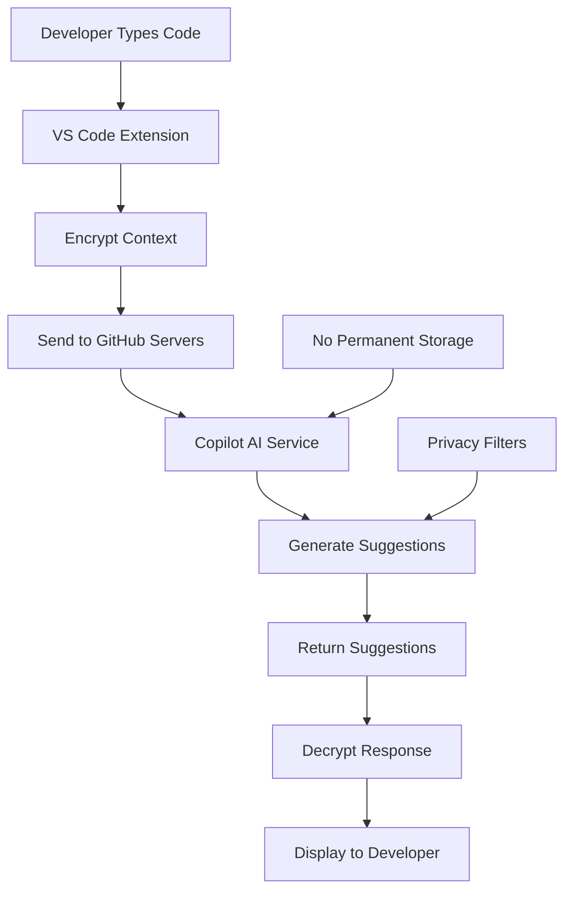

# How GitHub Copilot Works and Handles Data

## Overview
Understanding how GitHub Copilot processes data and generates suggestions is crucial for both effective usage and the certification exam. This guide covers the technical architecture, data flow, and processing mechanisms.

## Technical Architecture

### AI Model Foundation
GitHub Copilot is built on OpenAI's Codex model, which is based on GPT (Generative Pre-trained Transformer) architecture.

#### Model Characteristics
- **Large Language Model**: Trained on billions of lines of code
- **Transformer Architecture**: Attention mechanisms for context understanding
- **Multi-modal Capabilities**: Processes code, comments, and natural language
- **Continuous Learning**: Model improvements through ongoing research

### Training Data Sources
```yaml
training_data:
  sources:
    - public_repositories: "GitHub public repos"
    - open_source_projects: "Popular OSS projects"
    - documentation: "Technical documentation"
    - code_examples: "Tutorial and example code"
  
  filtering:
    - quality_metrics: "Code quality scoring"
    - license_compliance: "Respect for licensing terms"
    - privacy_protection: "Removal of sensitive data"
    - deduplication: "Duplicate code removal"
  
  volume:
    - total_lines: "54+ billion lines of code"
    - languages: "30+ programming languages"
    - timeframe: "Code from multiple years"
```

## Data Processing Pipeline

### Input Processing
When you type code, GitHub Copilot processes multiple types of context:

#### Context Sources
```python
# Example: What Copilot "sees" when generating suggestions
context_data = {
    # Current file content
    "current_file": {
        "content": "Current file up to cursor position",
        "language": "python",
        "file_path": "src/utils/calculator.py"
    },
    
    # Related files (when relevant)
    "related_files": [
        {
            "path": "src/models/user.py",
            "relevance": "imports and type definitions"
        },
        {
            "path": "tests/test_calculator.py", 
            "relevance": "usage patterns and examples"
        }
    ],
    
    # User input and cursor position
    "user_context": {
        "cursor_position": {"line": 42, "column": 15},
        "recent_edits": "Last 5 minutes of changes",
        "selected_text": "Currently highlighted code"
    },
    
    # Comment and docstring context
    "natural_language": {
        "comments": "Function and inline comments",
        "docstrings": "Method documentation",
        "variable_names": "Descriptive identifiers"
    }
}
```

### Suggestion Generation Process

#### Step-by-Step Processing
1. **Context Extraction**: Gather relevant context from multiple sources
2. **Intent Recognition**: Understand what the developer is trying to accomplish
3. **Pattern Matching**: Identify similar patterns from training data
4. **Code Generation**: Generate contextually appropriate suggestions
5. **Ranking**: Score and rank multiple possible suggestions
6. **Filtering**: Apply safety and quality filters
7. **Delivery**: Present suggestions to the developer

#### Real-time Processing
```python
# Simplified representation of suggestion generation
class CopilotSuggestionEngine:
    def generate_suggestion(self, context: CodeContext) -> Suggestion:
        # 1. Extract and tokenize context
        tokens = self.tokenize(context.get_context_window())
        
        # 2. Process through transformer model
        model_output = self.model.forward(tokens)
        
        # 3. Generate candidate suggestions
        candidates = self.decode_suggestions(model_output)
        
        # 4. Apply filters and ranking
        filtered_suggestions = self.filter_suggestions(candidates)
        ranked_suggestions = self.rank_suggestions(filtered_suggestions)
        
        # 5. Return best suggestion
        return ranked_suggestions[0] if ranked_suggestions else None
```

## Data Handling and Privacy

### What Data Is Processed

#### User Code Context
- **Active file content**: Code in the current file being edited
- **Related files**: Imports, dependencies, and related modules
- **Project structure**: File organization and naming patterns
- **Git context**: Commit messages and branch information (when relevant)

#### Metadata Processing
```json
{
  "request_metadata": {
    "timestamp": "2024-06-07T10:30:00Z",
    "ide": "VS Code",
    "language": "python",
    "file_extension": ".py",
    "context_length": 2048,
    "suggestion_type": "completion"
  },
  "performance_metrics": {
    "response_time_ms": 150,
    "model_confidence": 0.85,
    "suggestions_generated": 3
  }
}
```

### What Data Is NOT Stored

#### Privacy Protections
- **No permanent storage**: User code is not stored long-term
- **No user identification**: Suggestions aren't linked to specific users
- **No cross-user data**: One user's code doesn't influence another's suggestions
- **Processing only**: Data used only for immediate suggestion generation

### Data Flow Architecture

#### Client-Server Communication


#### Security Measures
```python
# Example: Data handling security measures
class SecureDataProcessor:
    def __init__(self):
        self.encryption = AES256Encryption()
        self.privacy_filter = PrivacyFilter()
        
    def process_request(self, code_context: str) -> str:
        # 1. Apply privacy filters
        filtered_context = self.privacy_filter.remove_sensitive_data(code_context)
        
        # 2. Encrypt for transmission
        encrypted_context = self.encryption.encrypt(filtered_context)
        
        # 3. Process through AI model
        suggestion = self.ai_model.generate(encrypted_context)
        
        # 4. Immediate cleanup
        self.cleanup_temporary_data()
        
        return suggestion
    
    def cleanup_temporary_data(self):
        """Ensure no data persists after processing"""
        # Clear all temporary processing artifacts
        pass
```

## Content Filtering and Safety

### Multi-Layer Filtering System

#### Pre-Processing Filters
```python
# Example: Input filtering before AI processing
class ContentFilter:
    def __init__(self):
        self.sensitive_patterns = [
            r'password\s*=\s*["\'].*["\']',
            r'api_key\s*=\s*["\'].*["\']',
            r'private_key\s*=\s*["\'].*["\']',
            r'\b[A-Z0-9]{20,}\b'  # Potential tokens/keys
        ]
    
    def filter_sensitive_content(self, code: str) -> str:
        """Remove sensitive information before AI processing"""
        filtered_code = code
        
        for pattern in self.sensitive_patterns:
            filtered_code = re.sub(pattern, '[REDACTED]', filtered_code)
        
        return filtered_code
```

#### Post-Processing Validation
```python
# Example: Output validation after AI generation
class OutputValidator:
    def validate_suggestion(self, suggestion: str, context: str) -> bool:
        """Ensure AI suggestions meet safety and quality standards"""
        
        # Check for potential security issues
        if self.contains_security_vulnerabilities(suggestion):
            return False
        
        # Verify syntactic correctness
        if not self.is_syntactically_valid(suggestion, context.language):
            return False
        
        # Check for appropriate content
        if not self.is_appropriate_content(suggestion):
            return False
        
        return True
    
    def contains_security_vulnerabilities(self, code: str) -> bool:
        """Detect potential security issues in generated code"""
        vulnerability_patterns = [
            r'eval\s*\(',  # Potential code injection
            r'exec\s*\(',  # Potential code execution
            r'__import__\s*\(',  # Dynamic imports
            # Additional security patterns...
        ]
        
        return any(re.search(pattern, code) for pattern in vulnerability_patterns)
```

## Performance and Optimization

### Latency Optimization

#### Caching Strategies
```python
# Example: Intelligent caching for better performance
class SuggestionCache:
    def __init__(self):
        self.context_cache = LRUCache(maxsize=1000)
        self.suggestion_cache = LRUCache(maxsize=5000)
    
    def get_cached_suggestion(self, context_hash: str) -> Optional[str]:
        """Retrieve cached suggestion for similar context"""
        return self.suggestion_cache.get(context_hash)
    
    def cache_suggestion(self, context_hash: str, suggestion: str):
        """Cache suggestion for future similar contexts"""
        self.suggestion_cache[context_hash] = suggestion
    
    def compute_context_hash(self, context: CodeContext) -> str:
        """Generate hash for context similarity matching"""
        # Normalize and hash context for efficient lookup
        normalized_context = self.normalize_context(context)
        return hashlib.sha256(normalized_context.encode()).hexdigest()
```

#### Network Optimization
- **Request Batching**: Combine multiple requests when possible
- **Compression**: Efficient data compression for transmission
- **CDN Usage**: Geographically distributed processing
- **Connection Pooling**: Reuse network connections

### Model Serving Architecture

#### Distributed Processing
```yaml
infrastructure:
  load_balancing:
    - geographic_distribution: "Multiple regions"
    - auto_scaling: "Demand-based scaling"
    - health_monitoring: "Continuous uptime checks"
  
  model_serving:
    - gpu_clusters: "High-performance inference"
    - model_sharding: "Distributed model weights"
    - request_routing: "Intelligent request distribution"
  
  monitoring:
    - latency_tracking: "Sub-200ms response times"
    - error_monitoring: "Comprehensive error tracking"
    - usage_analytics: "Performance optimization data"
```

## Integration Mechanisms

### IDE Integration Architecture

#### VS Code Extension
```typescript
// Simplified VS Code extension architecture
class CopilotExtension {
    private apiClient: CopilotAPIClient;
    private contextProvider: ContextProvider;
    private suggestionRenderer: SuggestionRenderer;
    
    async provideSuggestions(document: TextDocument, position: Position): Promise<Suggestion[]> {
        // 1. Extract context from current document and workspace
        const context = await this.contextProvider.extractContext(document, position);
        
        // 2. Send request to Copilot service
        const suggestions = await this.apiClient.getSuggestions(context);
        
        // 3. Render suggestions in editor
        return this.suggestionRenderer.formatSuggestions(suggestions);
    }
    
    private async extractContext(document: TextDocument, position: Position): Promise<CodeContext> {
        return {
            currentFile: document.getText(),
            cursorPosition: position,
            language: document.languageId,
            relatedFiles: await this.findRelatedFiles(document),
            projectContext: await this.getProjectContext()
        };
    }
}
```

#### Real-time Synchronization
```python
# Example: Real-time context synchronization
class ContextSynchronizer:
    def __init__(self):
        self.debounce_timer = None
        self.context_buffer = ContextBuffer()
    
    def on_text_change(self, change_event: TextChangeEvent):
        """Handle real-time text changes"""
        # Update context buffer
        self.context_buffer.apply_change(change_event)
        
        # Debounce requests to avoid overwhelming the service
        if self.debounce_timer:
            self.debounce_timer.cancel()
        
        self.debounce_timer = Timer(0.3, self.request_suggestions)
        self.debounce_timer.start()
    
    def request_suggestions(self):
        """Request new suggestions after text stabilizes"""
        current_context = self.context_buffer.get_current_context()
        # Send to Copilot service...
```

## Quality Assurance

### Suggestion Quality Metrics

#### Automated Quality Assessment
```python
# Example: Quality scoring system
class QualityAssessment:
    def score_suggestion(self, suggestion: str, context: CodeContext) -> float:
        """Score suggestion quality from 0.0 to 1.0"""
        
        scores = {
            'syntax': self.check_syntax_validity(suggestion, context.language),
            'context_relevance': self.assess_context_relevance(suggestion, context),
            'code_quality': self.evaluate_code_quality(suggestion),
            'security': self.check_security_implications(suggestion),
            'performance': self.assess_performance_implications(suggestion)
        }
        
        # Weighted average of quality dimensions
        weights = {
            'syntax': 0.3,
            'context_relevance': 0.3,
            'code_quality': 0.2,
            'security': 0.15,
            'performance': 0.05
        }
        
        total_score = sum(scores[metric] * weights[metric] for metric in scores)
        return total_score
```

### Continuous Improvement

#### Feedback Loop Integration
- **Usage Analytics**: Track suggestion acceptance rates
- **Error Monitoring**: Identify problematic suggestions
- **A/B Testing**: Compare model performance
- **User Feedback**: Incorporate developer feedback

## Certification Exam Focus

### Key Understanding Points
1. **Data Flow**: How user code becomes AI suggestions
2. **Privacy Protection**: What data is and isn't stored
3. **Processing Pipeline**: Steps from input to output
4. **Quality Assurance**: How suggestions are validated
5. **Performance Optimization**: Caching and latency management

### Common Exam Topics
- "Explain how Copilot processes user code context"
- "What privacy protections are in place for user data?"
- "How does Copilot ensure suggestion quality?"
- "Describe the real-time processing architecture"
- "What happens to user code after suggestions are generated?"

---
*Continue to: [07-testing-with-copilot.md](./07-testing-with-copilot.md)*
