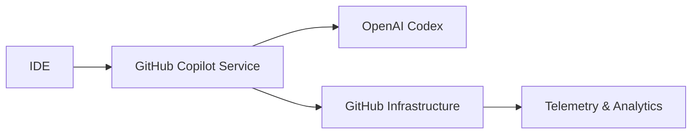
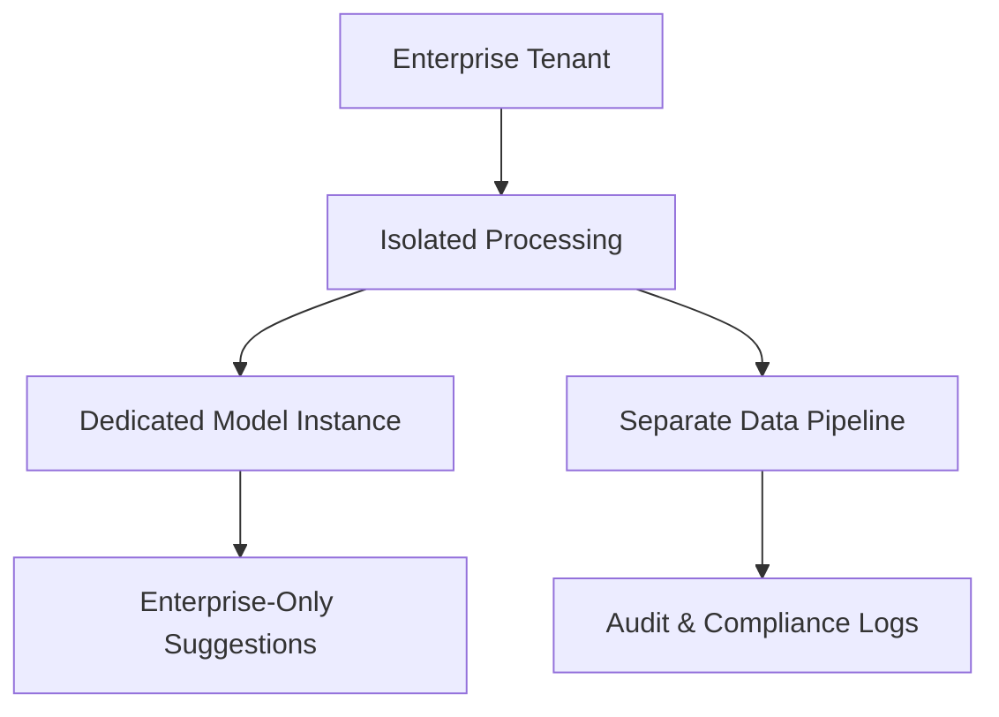
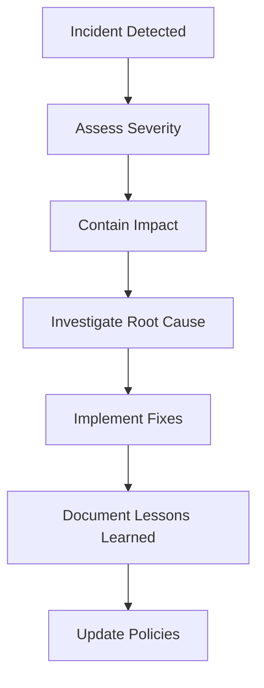

# Privacy Fundamentals and Content Exclusions

## Overview
Understanding how GitHub Copilot handles data privacy, content filtering, and exclusion mechanisms to ensure secure and compliant development.

## Table of Contents
1. [Privacy Fundamentals](#privacy-fundamentals)
2. [Data Handling and Retention](#data-handling-and-retention)
3. [Content Exclusions](#content-exclusions)
4. [Enterprise Privacy Features](#enterprise-privacy-features)
5. [Compliance and Regulations](#compliance-and-regulations)
6. [Best Practices](#best-practices)

## Privacy Fundamentals

### What Data Does Copilot Collect?

#### User Engagement Data
- **Suggestions shown vs accepted**: Tracks effectiveness
- **User actions**: Edit, accept, reject suggestions
- **Feature usage**: Which Copilot features are used
- **Performance metrics**: Response times, errors

#### Code Context Data
- **Surrounding code**: Limited context around cursor
- **File type and language**: For appropriate suggestions
- **Recently opened files**: For better context understanding
- **Comments and documentation**: To understand intent

### What Data Is NOT Collected

❌ **Complete file contents** (only relevant snippets)
❌ **Sensitive credentials** (filtered out)
❌ **Personal information** (beyond necessary context)
❌ **Private repository details** (unless explicitly enabled)

### Data Transmission



## Data Handling and Retention

### Data Processing Flow

1. **Code Snippet Extraction**
   - Limited context around cursor position
   - File type and language detection
   - Comment analysis for intent

2. **Filtering and Sanitization**
   - Remove potential secrets
   - Filter sensitive patterns
   - Apply content policies

3. **Model Inference**
   - Send sanitized context to model
   - Generate suggestions
   - Apply safety filters

4. **Response Delivery**
   - Return filtered suggestions
   - Log usage telemetry
   - Update user experience metrics

### Data Retention Policies

| Data Type | Retention Period | Purpose |
|-----------|------------------|---------|
| Code snippets | Not stored permanently | Real-time suggestions only |
| Telemetry data | 24 months | Service improvement |
| Usage analytics | 12 months | Feature optimization |
| Error logs | 90 days | Debugging and support |

### Geographic Data Handling

- **Data residency**: Processed in specific regions
- **Cross-border transfers**: Compliant with regulations
- **Regional compliance**: GDPR, CCPA, etc.

## Content Exclusions

### Automatic Content Filtering

#### 1. Sensitive Data Detection
```javascript
// Copilot filters potential secrets
const config = {
  // This would be filtered if it looks like a real API key
  apiKey: "sk-1234567890abcdef...", // ❌ Filtered
  
  // This is allowed as it's clearly a placeholder
  apiKey: "YOUR_API_KEY_HERE", // ✅ Allowed
  
  // Environment variable references are allowed
  apiKey: process.env.API_KEY // ✅ Allowed
};
```

#### 2. Personal Information Filtering
```python
# Copilot avoids suggesting real personal data
user = {
    "name": "John Doe",  # Generic example, allowed
    "email": "user@example.com",  # Generic example, allowed
    "ssn": "123-45-6789"  # Avoided if looks real
}
```

### Content Exclusion Configuration

#### Repository-Level Exclusions
```yaml
# .github/copilot-exclusions.yml
version: 1
exclusions:
  paths:
    - "config/secrets.yml"
    - "*.env"
    - "private/**"
  patterns:
    - "password"
    - "secret"
    - "token"
```

#### Organization-Level Controls
- **Repository inclusion/exclusion lists**
- **Content filtering policies**
- **Audit logging requirements**

### Manual Content Exclusions

#### 1. File-Level Exclusions
```javascript
// copilot:disable-file
// This file is excluded from Copilot training and suggestions

const secretConfig = {
  apiKey: "real-secret-key",
  dbPassword: "super-secret-password"
};
```

#### 2. Block-Level Exclusions
```python
def secure_function():
    # copilot:disable-next-line
    secret_key = get_secret_from_vault()
    
    # copilot:disable-start
    encrypted_data = encrypt_with_secret(
        data=sensitive_data,
        key=secret_key
    )
    # copilot:disable-end
    
    return encrypted_data
```

## Enterprise Privacy Features

### GitHub Copilot Business/Enterprise

#### Enhanced Privacy Controls
- **No training on business data**: Code not used for model training
- **Audit logs**: Comprehensive usage tracking
- **Policy management**: Organization-wide settings
- **Content exclusions**: Advanced filtering options

#### Data Isolation


### Administrative Controls

#### Organization Settings
```json
{
  "copilot": {
    "enabled": true,
    "public_code_suggestions": false,
    "content_exclusions": {
      "repositories": ["private-repo-1", "secret-project"],
      "file_patterns": ["*.env", "config/secrets/*"],
      "content_patterns": ["password", "api_key", "token"]
    },
    "audit_logging": true,
    "data_retention": "minimal"
  }
}
```

#### User Management
- **Seat allocation**: Control who has access
- **Feature restrictions**: Limit specific Copilot features
- **Usage monitoring**: Track individual usage patterns

## Compliance and Regulations

### GDPR Compliance

#### Data Subject Rights
- **Right to access**: Users can request their data
- **Right to rectification**: Correction of inaccurate data
- **Right to erasure**: Deletion of personal data
- **Right to portability**: Export user data

#### Privacy by Design
- **Data minimization**: Collect only necessary data
- **Purpose limitation**: Use data only for stated purposes
- **Storage limitation**: Retain data only as needed

### CCPA Compliance

#### California Consumer Rights
- **Right to know**: What personal information is collected
- **Right to delete**: Request deletion of personal information
- **Right to opt-out**: Stop sale of personal information
- **Right to non-discrimination**: No penalties for exercising rights

### SOC 2 Type II

#### Security Controls
- **Access controls**: Who can access what data
- **Encryption**: Data protection in transit and at rest
- **Monitoring**: Continuous security monitoring
- **Incident response**: Procedures for security incidents

## Best Practices

### For Individual Developers

#### 1. Review Suggestions Carefully
```javascript
// Always review Copilot suggestions for sensitive content
const config = {
  // ✅ Good: Use environment variables
  apiKey: process.env.API_KEY,
  
  // ❌ Avoid: Hardcoded secrets (even if Copilot suggests)
  // apiKey: "sk-1234567890abcdef"
};
```

#### 2. Use Exclusion Comments
```python
def handle_payment(card_number, cvv, expiry):
    # copilot:disable-next-line
    # Ensure sensitive payment data is not logged
    encrypted_card = encrypt_pci_data(card_number)
    
    return process_payment(encrypted_card)
```

#### 3. Configure IDE Settings
```json
// VS Code settings.json
{
  "github.copilot.enable": {
    "*": true,
    "plaintext": false,
    "markdown": false,
    "yaml": false
  }
}
```

### For Organizations

#### 1. Implement Content Policies
```yaml
# Organization policy template
copilot_policy:
  enabled_repositories:
    - "public-projects/*"
    - "open-source/*"
  
  excluded_repositories:
    - "customer-data/*"
    - "compliance/*"
    - "security/*"
  
  content_filters:
    - "social_security_number"
    - "credit_card_number"
    - "api_key"
    - "password"
```

#### 2. Regular Audits
```python
# Example audit script structure
class CopilotAuditReport:
    def __init__(self):
        self.usage_stats = {}
        self.privacy_violations = []
        self.compliance_status = {}
    
    def generate_monthly_report(self):
        # Collect usage data
        # Check compliance status
        # Identify potential issues
        pass
```

#### 3. Training and Awareness
- **Developer education**: Privacy best practices
- **Policy communication**: Clear guidelines
- **Regular updates**: Keep policies current

### Data Classification

#### Sensitivity Levels
```python
# Example data classification
class DataClassification:
    PUBLIC = "public"          # Open source, documentation
    INTERNAL = "internal"      # Company code, business logic
    CONFIDENTIAL = "confidential"  # Customer data, financial
    RESTRICTED = "restricted"  # Secrets, compliance data

# Usage guidelines
@data_classification(DataClassification.CONFIDENTIAL)
def process_customer_data(customer_info):
    # copilot:disable-file
    # This function handles confidential customer data
    pass
```

## Privacy Settings Configuration

### VS Code Settings
```json
{
  "github.copilot.advanced": {
    "length": 500,
    "inlineSuggestCount": 3,
    "debug.overrideEngine": "",
    "debug.testOverrideProxyUrl": "",
    "debug.filterLogCategories": []
  },
  "github.copilot.enable": {
    "*": true,
    "yaml": false,
    "plaintext": false
  }
}
```

### JetBrains IDEs
```kotlin
// IntelliJ IDEA settings
copilot {
    enabled = true
    automaticCompletions = true
    showCompletionsInComments = false
    logLevel = "ERROR"
}
```

## Incident Response

### Privacy Incident Handling

#### 1. Detection
- **Automated monitoring**: Unusual data patterns
- **User reports**: Manual incident reporting
- **System alerts**: Privacy threshold violations

#### 2. Response Process


#### 3. Communication
- **Internal notifications**: Privacy team, legal
- **External communications**: Regulatory bodies if required
- **User notifications**: If personal data affected

## Key Takeaways

- Copilot processes minimal data needed for suggestions
- Content filtering protects sensitive information
- Enterprise features provide enhanced privacy controls
- Organizations can implement granular exclusion policies
- Regular audits ensure compliance maintenance
- Privacy by design principles guide development

## Certification Tips

- Understand data collection vs. data storage differences
- Know content exclusion mechanisms and syntax
- Familiarize yourself with enterprise privacy features
- Understand major compliance frameworks (GDPR, CCPA)
- Practice configuring privacy settings in different IDEs
- Know incident response procedures for privacy issues
