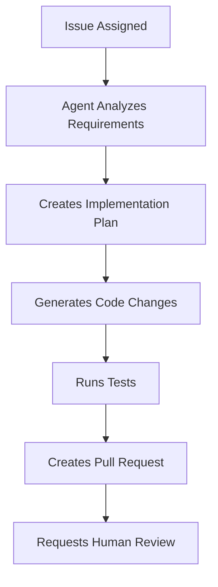

# Emerging GitHub Copilot Features (2025)

## Overview
This guide covers the latest GitHub Copilot features and capabilities introduced in 2024-2025, ensuring your certification preparation includes the most current information available.

## Table of Contents
1. [GitHub Copilot Spaces](#github-copilot-spaces)
2. [Copilot Coding Agent](#copilot-coding-agent)
3. [GitHub Copilot Extensions](#github-copilot-extensions)
4. [Model Context Protocol (MCP)](#model-context-protocol-mcp)
5. [Custom Instructions](#custom-instructions)
6. [AI Models Selection](#ai-models-selection)
7. [Enhanced Reference System](#enhanced-reference-system)
8. [Advanced Enterprise Features](#advanced-enterprise-features)

---

## GitHub Copilot Spaces

### What are Copilot Spaces?
**Release Date**: May 2025  
GitHub Copilot Spaces is a new collaborative environment that allows developers to work with code and context in a shared, AI-enhanced workspace.

### Key Features
- **Shared Context**: Collaborate with AI and team members in real-time
- **Persistent Sessions**: Maintain context across multiple coding sessions
- **Multi-Repository Support**: Work across multiple repositories simultaneously
- **Enhanced Code Understanding**: AI maintains deeper project context

### Usage Examples
```typescript
// Example: Working in a Copilot Space
// Context: E-commerce platform with multiple microservices
// Space includes: auth-service, payment-service, order-service

// Copilot understands relationships across services
interface PaymentRequest {
  userId: string; // References auth-service User model
  orderId: string; // References order-service Order model
  amount: number;
  currency: string;
}

// AI suggestions consider all services in the space
class PaymentProcessor {
  async processPayment(request: PaymentRequest): Promise<PaymentResult> {
    // Copilot suggests implementation considering:
    // - Auth service user validation patterns
    // - Order service order status updates
    // - Payment service transaction handling
  }
}
```

### Best Practices
1. **Organize by Project Scope**: Include related repositories
2. **Maintain Clean Context**: Regularly clean up unused files
3. **Document Relationships**: Help AI understand service dependencies
4. **Use Descriptive Names**: Clear space names improve AI understanding

---

## Copilot Coding Agent

### Agent Capabilities
The Copilot Coding Agent can perform autonomous coding tasks when assigned GitHub issues or pull requests.

### Supported Tasks
- **Issue Implementation**: Complete feature implementations from GitHub issues
- **Bug Fixes**: Automated bug resolution with testing
- **Code Refactoring**: Large-scale code improvements
- **Documentation Generation**: Comprehensive project documentation

### Assignment Process
```bash
# Assign an issue to Copilot
# In GitHub issue comments:
@copilot implement this feature

# Or assign directly:
# In issue sidebar, assign to @copilot
```

### Agent Workflow


### Configuration Example
```yaml
# .github/copilot-agent.yml
agent:
  auto_assign:
    labels: ["copilot-ready", "bug", "enhancement"]
  testing:
    run_tests: true
    require_passing: true
  review:
    require_human_approval: true
    reviewers: ["@team-leads"]
  limits:
    max_files_changed: 10
    max_lines_changed: 500
```

---

## GitHub Copilot Extensions

### Extension Ecosystem
GitHub Copilot Extensions allow third-party tools and services to integrate directly with Copilot Chat.

### Popular Extensions
- **Azure DevOps**: Project management integration
- **Datadog**: Monitoring and observability
- **Sentry**: Error tracking and debugging
- **Docker**: Container management
- **Kubernetes**: Orchestration assistance

### Using Extensions
```
# In Copilot Chat
@datadog show recent errors for my-app

@docker create dockerfile for node.js app with redis

@sentry analyze this error stack trace:
[paste stack trace]

@azure create work item for this bug
```

### Building Custom Extensions
```typescript
// Example: Custom extension for company APIs
interface CopilotExtension {
  name: string;
  description: string;
  capabilities: ExtensionCapability[];
}

class CompanyAPIExtension implements CopilotExtension {
  name = "company-api";
  description = "Internal API documentation and code generation";
  
  async handleRequest(prompt: string, context: ChatContext): Promise<ExtensionResponse> {
    // Parse user request
    const intent = await this.parseIntent(prompt);
    
    // Generate response based on company APIs
    switch (intent.type) {
      case 'api-docs':
        return await this.generateAPIDocumentation(intent.apiName);
      case 'code-example':
        return await this.generateCodeExample(intent.endpoint);
      default:
        return { message: "I can help with company API documentation and examples." };
    }
  }
}
```

---

## Model Context Protocol (MCP)

### MCP Overview
The Model Context Protocol enables Copilot to integrate with external data sources and tools seamlessly.

### MCP Server Examples
```python
# Example: Custom MCP server for internal documentation
from mcp import MCPServer, Resource, Tool

class DocumentationMCPServer(MCPServer):
    def __init__(self):
        super().__init__("internal-docs")
        
    async def list_resources(self) -> list[Resource]:
        """List available documentation resources"""
        return [
            Resource(
                uri="docs://api-reference",
                name="API Reference",
                mimeType="text/markdown"
            ),
            Resource(
                uri="docs://architecture",
                name="System Architecture", 
                mimeType="text/markdown"
            )
        ]
    
    async def read_resource(self, uri: str) -> str:
        """Read documentation content"""
        if uri == "docs://api-reference":
            return await self.load_api_docs()
        elif uri == "docs://architecture":
            return await self.load_architecture_docs()
        
    async def list_tools(self) -> list[Tool]:
        """List available tools"""
        return [
            Tool(
                name="search_docs",
                description="Search internal documentation",
                inputSchema={
                    "type": "object",
                    "properties": {
                        "query": {"type": "string"}
                    }
                }
            )
        ]
```

### MCP Configuration
```json
{
  "mcpServers": {
    "internal-docs": {
      "command": "python",
      "args": ["mcp_server.py"],
      "env": {
        "DOCS_API_KEY": "${DOCS_API_KEY}"
      }
    },
    "database-schema": {
      "command": "node",
      "args": ["db-mcp-server.js"],
      "env": {
        "DATABASE_URL": "${DATABASE_URL}"
      }
    }
  }
}
```

---

## Custom Instructions

### Personal Custom Instructions
Set global preferences that Copilot follows across all projects.

```markdown
# Personal Copilot Instructions

## Coding Style Preferences
- Use TypeScript for all JavaScript projects
- Prefer functional programming patterns
- Always include comprehensive error handling
- Write JSDoc comments for all functions
- Use async/await instead of Promises.then()

## Testing Preferences
- Write Jest tests for all new functions
- Aim for 80%+ code coverage
- Include edge case testing
- Use descriptive test names

## Documentation Standards
- Include README.md for all projects
- Document API endpoints with OpenAPI/Swagger
- Maintain CHANGELOG.md for version tracking
- Include code examples in documentation
```

### Repository Custom Instructions
Project-specific guidelines that override personal instructions.

```markdown
# Repository Instructions for E-commerce Platform

## Architecture Patterns
- Use microservices architecture
- Implement Circuit Breaker pattern for external calls
- Use Event Sourcing for order processing
- Follow Domain-Driven Design principles

## Technology Stack
- Backend: Node.js with Express
- Database: PostgreSQL with TypeORM
- Message Queue: Redis with Bull
- Monitoring: DataDog APM

## Specific Patterns
- Use Dependency Injection for all services
- Implement request/response logging middleware
- Use Joi for input validation
- Follow RESTful API design principles

## Security Requirements
- Validate all inputs
- Use JWT for authentication
- Implement rate limiting
- Log all security events
```

---

## AI Models Selection

### Available Models
GitHub Copilot now supports multiple AI models for different use cases.

```typescript
// Model configuration example
interface CopilotModelConfig {
  model: 'gpt-4' | 'claude-3' | 'codellama' | 'starcoder';
  temperature: number;
  maxTokens: number;
  specialization: 'general' | 'code' | 'analysis' | 'refactoring';
}

// Usage examples
const configs = {
  codeGeneration: {
    model: 'codellama',
    temperature: 0.2,
    specialization: 'code'
  },
  codeAnalysis: {
    model: 'gpt-4',
    temperature: 0.1,
    specialization: 'analysis'
  },
  refactoring: {
    model: 'claude-3',
    temperature: 0.3,
    specialization: 'refactoring'
  }
};
```

### Model Selection Guidelines
| Use Case | Recommended Model | Reasoning |
|----------|------------------|-----------|
| Code Generation | CodeLlama/StarCoder | Specialized for code synthesis |
| Code Analysis | GPT-4 | Superior reasoning capabilities |
| Documentation | Claude-3 | Excellent at explanatory text |
| Refactoring | GPT-4 | Complex code transformation |
| Debugging | GPT-4 | Strong analytical reasoning |

---

## Enhanced Reference System

### @ Symbol References
Copilot Chat now supports attaching specific references using the @ symbol.

```
# Reference specific files
@package.json show me how to add a new dependency

# Reference functions
@calculateTax explain this function and suggest optimizations

# Reference documentation
@README.md update this with the new API endpoints

# Reference issues
@#123 implement the feature described in this issue

# Reference pull requests
@!456 review this PR and suggest improvements
```

### Advanced Reference Patterns
```
# Multi-file context
@src/models/User.ts @src/services/UserService.ts 
Create a new method to update user preferences

# Documentation with code
@docs/api.md @src/api/routes.ts 
Ensure the documentation matches the implementation

# Test with implementation
@src/utils/validator.ts @tests/validator.test.ts
Add validation for email addresses and update tests
```

---

## Advanced Enterprise Features

### Enhanced Security Controls
```yaml
# Enterprise security configuration
security:
  content_filtering:
    enabled: true
    sensitivity_levels:
      - pii_detection
      - credential_scanning
      - proprietary_code_blocking
  
  audit_logging:
    level: detailed
    retention_period: "2 years"
    export_format: "json"
  
  compliance:
    frameworks:
      - sox
      - gdpr
      - hipaa
    automated_reporting: true
```

### Advanced Analytics
```javascript
// Enterprise analytics dashboard data
const copilotMetrics = {
  productivity: {
    codeGenerationRate: "45% faster development",
    bugReductionRate: "32% fewer bugs",
    codeQualityImprovement: "18% better code quality scores"
  },
  adoption: {
    activeUsers: 847,
    dailyActiveUsers: 623,
    weeklyActiveUsers: 789,
    adoptionTrend: "increasing"
  },
  usage: {
    suggestionsPerDay: 15420,
    acceptanceRate: 68.5,
    chatInteractions: 3240,
    extensionUsage: {
      datadog: 234,
      azure: 156,
      docker: 445
    }
  }
};
```

---

## Certification Exam Focus

### Key Points for 2025 Certification
1. **Understand Copilot Spaces** - New collaborative features
2. **Know Coding Agent Capabilities** - Autonomous task completion
3. **Extension Ecosystem** - Third-party integrations
4. **MCP Integration** - External tool connectivity
5. **Custom Instructions** - Personalization and project-specific guidance
6. **Model Selection** - When to use different AI models
7. **Enhanced References** - @ symbol usage patterns

### Practice Scenarios
1. Set up a Copilot Space for a multi-service application
2. Configure custom instructions for a new project
3. Create an MCP server for internal tools
4. Use extensions for monitoring and deployment
5. Assign work to the Copilot Coding Agent
6. Select appropriate AI models for different tasks

### Common Exam Questions
- "What is the purpose of GitHub Copilot Spaces?"
- "How do you assign a GitHub issue to the Copilot Coding Agent?"
- "Which AI model is best for code refactoring tasks?"
- "How do custom instructions work in GitHub Copilot?"
- "What is the Model Context Protocol (MCP)?"

---

## Hands-On Exercises

### Exercise 1: Setting Up Copilot Spaces
1. Create a new Copilot Space for a microservices project
2. Add multiple repositories to the space
3. Test cross-repository code suggestions
4. Document the improved context understanding

### Exercise 2: Building a Custom Extension
1. Design a simple Copilot Extension for your company
2. Implement basic request handling
3. Test the extension in Copilot Chat
4. Document usage patterns

### Exercise 3: MCP Server Development
1. Create an MCP server for internal documentation
2. Implement resource and tool endpoints
3. Connect the server to Copilot
4. Test functionality with Chat queries

---

*This guide covers the latest GitHub Copilot features as of 2025. Continue to monitor GitHub's official documentation for additional updates and enhancements.*

---
*Continue to: [Next Study Topic] or return to [README.md](../README.md)*
